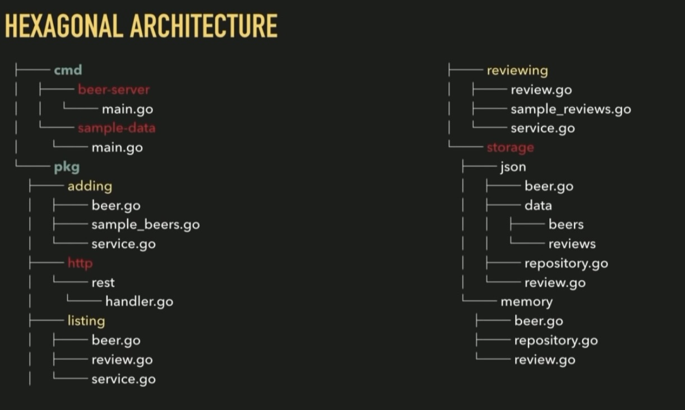

```
  ____         ____  _             
 / ___| ___   |  _ \| | __ _ _   _ 
| |  _ / _ \  | |_) | |/ _` | | | |
| |_| | (_) | |  __/| | (_| | |_| |
 \____|\___/  |_|   |_|\__,_|\__, |
                             |___/ 
```

GO Playground Project
=====================

This is the playground project to start with some go learning.

# Setup Go
Depending on your environment install go with

| OS | Command |
| --- | --- |
| Arch-based | `sudo pacman -S go` |
| Debian-based | `sudo apt install golang-go` |
| MacOS | `brew install go` |

Check if installation was successful with `go version`.

Ensure to have a `GOPATH` env variable set to `$HOME/go` and `$GOPATH/bin` in your `PATH` env variable. The directory `$HOME/go` should be created
automatically by the go installation. For instance you can put the 
following lines in your `.bashrc` or `.zshrc` file:

```bash
export GOPATH=$HOME/go
export PATH=$PATH:$GOPATH/bin
```


## Install a linter
Install a linter with `go install golang.org/x/lint/golint@latest`.


# Example Project/Module
Create a new directory `example1`.
  
```bash
mkdir example1
cd example1
go mod init example1
```

Write your code in `example1.go`:
  
```go
package main

import "fmt"

func main() {
    message := "Hello, world!"
    fmt.Printf("Message from Example1: %s\n", message)
}
```

Run it with `go run example1.go`.
To create an executable `example1` run `go build example1.go`.

Provide a `Makefile` to build and run the project:

```makefile
.DEFAULT_GOAL := build

fmt:
	@go fmt ./...
.PHONY: fmt

lint: fmt
	golint ./...
.PHONY: lint

vet: fmt
	go vet ./...
.PHONY: vet

build: vet
	go build -o example1
.PHONY: build
```

Execute it with `make`.


# Find a module
Visit [pkg.go.dev](https://pkg.go.dev/) to find a module.

# Domain-Driven Design Project Structure

Source: [GopherCon 2018 Kat Zien How Do You Structure Your Go Apps](https://www.youtube.com/watch?v=oL6JBUk6tj0)